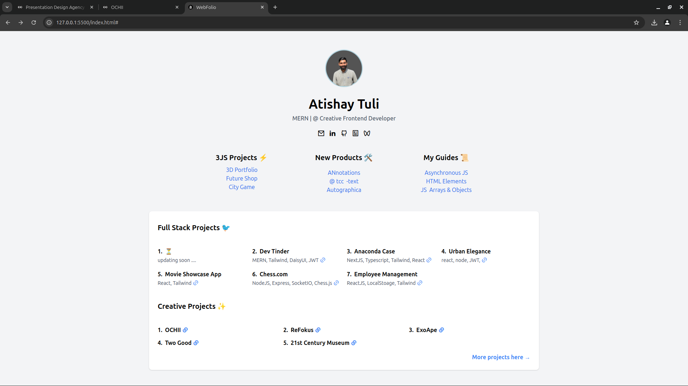
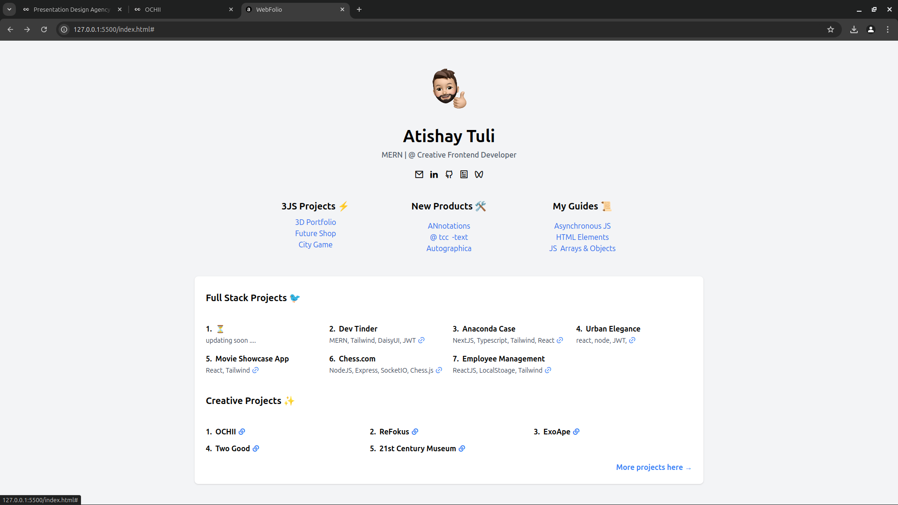

## WebFolio 🚀

Welcome to **WebFolio** ✨, a modern and interactive portfolio website showcasing my **web development projects**, creative tools, and guides. 

This project highlights : 
- **Full-stack web development projects** 
- **Creative tools and innovations** 
- **Revision guides** 
- **Flip Profile Image** 

### Purpose ✨

WebFolio is designed to present a curated showcase of my web development work, demonstrating my skills in building robust, user-friendly, and aesthetically pleasing applications. 




### How to Use 📌

1. Clone the repository :
 
   ```bash
   git clone https://github.com/atishaytuli07/webfolio.git

2. Navigate to project directory :
 
   ```bash
   cd webfolio

3. Open Index.html : 

   ```bash
   open index.html

4. Click on the Live Server :
 
   ```bash
   go live

### Customization ✍️

You can also use this WebFolio to Showcase your projects just do some chnages :

- **Update Images** Replace atishaytuli.png and memoji.png in the assets/ folder with your own images.
- **Edit Content** Modify the index.html file to update project details, links, and personal information.
- **Change Styles** Adjust the style section in the <head> or use a separate styles.css file for further customizations.
- **Here you go** Now you can use this Webfolio to showcase your work. 

### Acknowledgement 🙌

**Tailwind CSS**  For the beautiful and efficient utility-first styling.
**JavaScript**  For enabling interactivity.

thank you, Happy Coding !!
